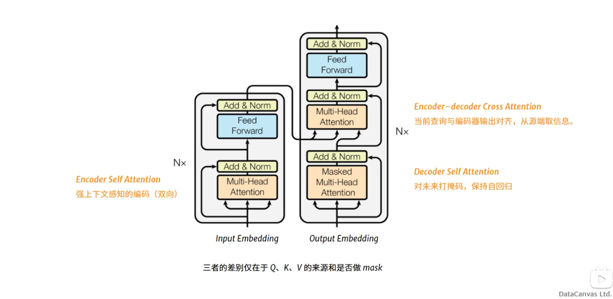
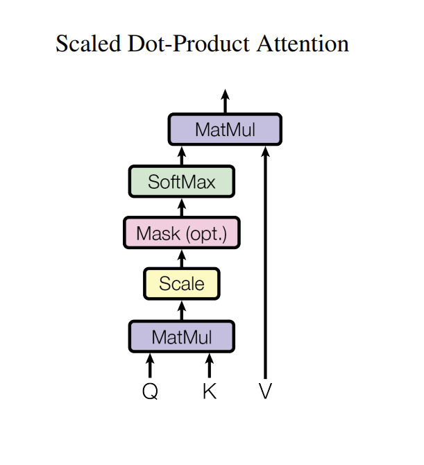
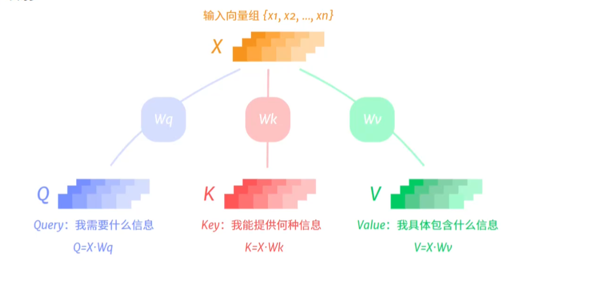
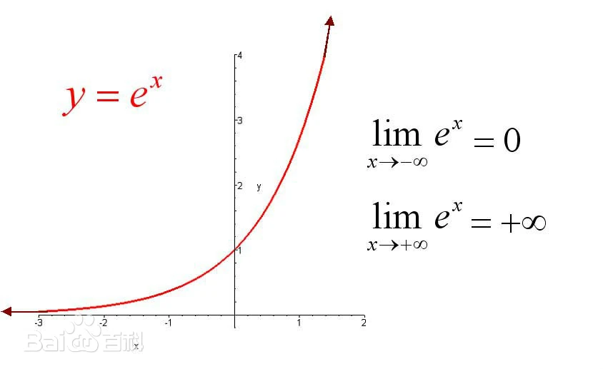
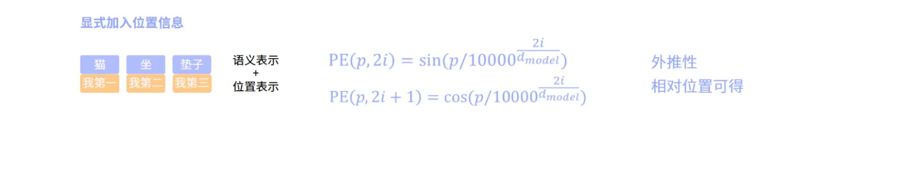
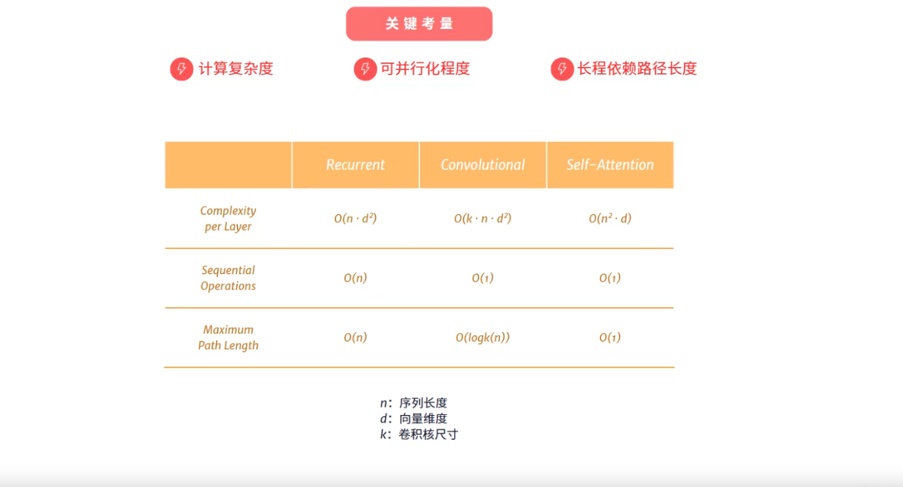

# Attention Is All You Need（学习笔记）

## 导览

课程位置：https://www.bilibili.com/video/BV1Fvp3zBEAN

### 为什么需要它

序列建模的问题

长距离依赖
- 指代回指
- 跨句因果
- 翻译重排

内容相关性
- 距离与语义需要

路径长度
- 距离越远，梯度容易衰减/爆炸

感受野
- CNN感受野靠堆叠层数扩大，仍是位置先验固定

并行化
- RNN必须串行

总结，
- RNN目光短浅（长距离依赖难）
- CNN小肚鸡肠（感受野有限）

#### Encoder & Decoder
符号嵌入序列：将信息切分后的结构。（symbol representations）
Encoder: 编码器，将符号嵌入序列转换为一组更具有语义结构的连续表示(continuous representations)。
- 每个位置的表示向量不仅包含原始语义，还整合了整个序列的上下文信息。
- 词的多义性会根据上下文被消解。例如，人称代词，她他它。
Decoder: 解码器，根据编码好的语义表示，自回归地持续生成新的离散符号（token）。
- 自回归：解码后的输出与最初的输入结合后重新作为解码器的输入。

## 模型架构

### Attention

人类理解一句话时，并不是每个词都同等重要。
全局总览，动态分配“注意力权重”，对输入的所有位置取加权和，形成上下文。

加性注意力（前馈网络）
- 非线性关系
- 速度慢

点积注意力（内积计算相关性）
- 表达能力弱
- 速度快

#### Scaled Dot-Product Attention (缩放点积注意力)

##### Step1：Q,K,V映射

**Why QKV？**
相关性计算（QK）和信息传递（V）解耦
W可学习，不同任务学习不同的信息。

##### Step2：相关度打分

##### Step3：计算注意力权重

非负性
归一化

softmax
- 连续可导
- 差异放大

##### Step 3.5：缩放因子
避免权重值爆炸，在进行softmax计算前，进行缩放。

缩放前，
- 极度尖锐
- 梯度接近0，学习不稳定

缩放后
- 更加平滑，保留候选
- 训练收敛好，表达多重依赖

**why sqrt(dk)?**
- 目标是让方差变为常数级
- 若用dk，则过于平坦。

##### Step 4：聚合信息

#### Multi Head Attention

点积注意力表达能力有限 -> 多视角计算注意力，缓解信息平均混合造成的损失。

多头注意力：多个头在不同子空间学不同的关注模式；各头结果融合后得到更丰富的表示。

表示能力不输加性，计算效率远超加性。

#### Masked Attention

生成是自回归的，模型只基于已生成的前缀做决定，不能“作弊”看未来。

### Poing-wise Feed Forward Networks（前馈网络）

FFN(x) = (max(o, xW1 + b1))W2 + b2
对x做两次线性变化，中间插入ReLU激活函数

特性，
- 逐位置独立
  - 序列中每个向量单独且同样的应用FFN
- 参数按层不同
  - 同一Transformer层用同一组W1，W2，b1，b2

优势，
- attention + FFN强强联手
  - 跨位置信息聚合 + 逐位置特征变换
- 表示能力增强
  - 维度“扩张再压回”，学到高维的中间表示
- 计算高度并行
  - 每个位置独立计算
- 序列长度不变

### Positional Encoding

Attention只能看见一个无序的几何。位置信息必须被显示加入。

为什么要使用三角函数？
- 能够表示相对位置关系
- 能够自然地扩展到更长的序列(可外推性)
- 值域有界且平滑

### Add & Norm

Add（残差链接）
- 缓解梯度爆炸/消失
- 让子层学习增量
- 稳定深层结构训练

Norm（层归一化）
- 加速收敛，提升泛化
- 稳定数值

Post-norm：收敛更快，但层数深了容易训练不稳定
Pre-norm：更稳定，可以训练击败层，现在多采用这种方案

### Why Self-Attention

